# v0ic3r 🎙️

[](https://v0ic3r.adhney.in)

A high-performance, real-time **Healthcare Voice Assistant** built with Go.

This project demonstrates a production-grade voice agent capable of handling complex medical scheduling, triage, and FAQs with sub-second latency. It features instant "barge-in" interruption handling and full mobile compatibility.

## 🎥 Demo

<div align="center">
  <a href="web/frontend/public/demo.mp4">
    
  </a>
</div>

> **Note**: If the video doesn't play, you can [download it here](web/frontend/public/demo.mp4).

## ✨ Features

- **🏥 Healthcare AI**: Pre-configured as a receptionist/scheduler for clinics.
- **⚡ Ultra-Low Latency**: Sub-second response times using **Gemini 2.0 Flash**.
- **🎤 Advanced STT**: Powered by **Deepgram Nova-3** for incredibly fast transcription.
- **🗣️ Human-like Voice**: Uses **ElevenLabs Flash v2.5** for near-instant speech generation.
- **🛑 Barge-In Support**: Users can interrupt the agent naturally; the agent stops speaking instantly.
- **📱 Mobile Optimized**: Verified iOS/Android support with custom audio context locking for consistent playback.
- **🔒 Sequential Audio**: Custom audio queueing system prevents overlap and glitches.

## 🏗️ Architecture

The system uses **LiveKit** for real-time WebRTC transport, orchestrating streams between the user and the AI services.

```mermaid
flowchart TD
    User["📱 User (Browser/Mobile)"]
    Backend["🚀 Go Backend"]
    Deepgram["Deepgram Nova-3"]
    Gemini["Gemini 2.0 Flash"]
    ElevenLabs["ElevenLabs v2.5"]

    User <-->|"WebRTC (LiveKit)"| Backend

    Backend -->|"Stream Audio"| Deepgram
    Deepgram -->|"Text"| Backend

    Backend -->|"Context + Prompt"| Gemini
    Gemini -->|"Streaming Response"| Backend

    Backend -->|"Text Stream"| ElevenLabs
    ElevenLabs -->|"Audio Chunks"| Backend

    Backend -->|"Audio Stream"| User
```



## 🛠️ Tech Stack

- **Backend**: Go (Golang)
- **Transport**: [LiveKit](https://livekit.io/) (WebRTC)
- **Speech-to-Text**: [Deepgram](https://deepgram.com/) Nova-3
- **LLM**: [Google Gemini](https://ai.google.dev/) 2.0 Flash
- **Text-to-Speech**: [ElevenLabs](https://elevenlabs.io/) Flash v2.5
- **Frontend**: React, TypeScript, Tailwind CSS, Vite

## 🚀 Quick Start

### Prerequisites

- Go 1.21+
- Node.js 20+
- API Keys for: Deepgram, Gemini, ElevenLabs, LiveKit

### Local Setup

1. **Clone the repo**

   ```bash
   git clone https://github.com/adhney/v0ic3r.git
   cd v0ic3r
   ```

2. **Configure Environment**
   Create a `.env` file in the root:

   ```env
   # Keys
   DEEPGRAM_API_KEY=your_key
   GEMINI_API_KEY=your_key
   ELEVENLABS_API_KEY=your_key

   # LiveKit (Cloud or Local)
   LIVEKIT_URL=wss://your-project.livekit.cloud
   LIVEKIT_API_KEY=your_api_key
   LIVEKIT_API_SECRET=your_api_secret

   # Settings
   TTS_PROVIDER=elevenlabs
   ENABLE_BARGE_IN=true
   PORT=8080
   ```

3. **Build Frontend**

   ```bash
   cd web/frontend
   npm install
   npm run build
   cd ../..
   ```

4. **Run Server**

   ```bash
   go run cmd/server/main.go
   ```

5. **Visit** `http://localhost:8080`

## 🌍 Deployment

The project is Dockerized and ready for platforms like **Koyeb**, **Fly.io**, or **Railway**.

### Docker

```bash
docker build -t v0ic3r .
docker run -p 8080:8080 --env-file .env v0ic3r
```

## 📝 License

MIT
